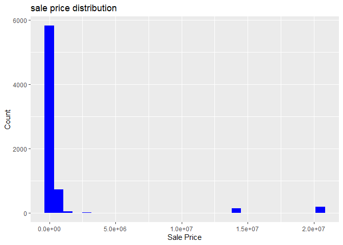
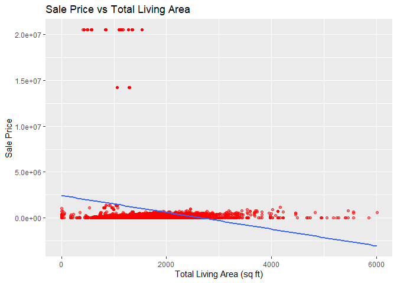
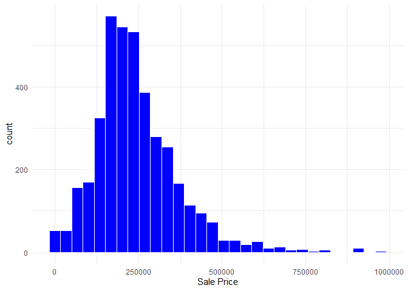
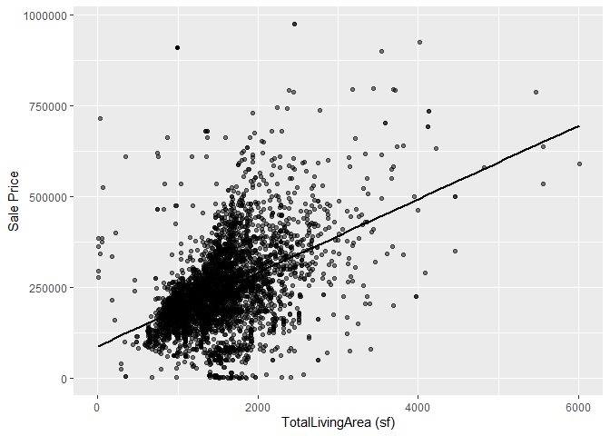

Lab 2: Exploring Residential Sales in Ames
================
Team 6: Ryan Horsey, Dominic DiRe, Amelia Humphrey, Huu Phuoc Tran
2026-03-04

<!-- README.md is generated from README.Rmd. Please edit the README.Rmd file -->

# Lab report \#1

Follow the instructions posted at
<https://ds202-at-isu.github.io/labs.html> for the lab assignment. The
work is meant to be finished during the lab time, but you have time
until Monday evening to polish things.

Include your answers in this document (Rmd file). Make sure that it
knits properly (into the md file). Upload both the Rmd and the md file
to your repository.

All submissions to the github repo will be automatically uploaded for
grading once the due date is passed. Submit a link to your repository on
Canvas (only one submission per team) to signal to the instructors that
you are done with your submission.

## Step 1: Inspecting the Dataset

``` r
# Load the dataset
data(ames)

# View first rows
head(ames)
```

    ## # A tibble: 6 × 16
    ##   `Parcel ID` Address      Style Occupancy `Sale Date` `Sale Price` `Multi Sale`
    ##   <chr>       <chr>        <fct> <fct>     <date>             <dbl> <chr>       
    ## 1 0903202160  1024 RIDGEW… 1 1/… Single-F… 2022-08-12        181900 <NA>        
    ## 2 0907428215  4503 TWAIN … 1 St… Condomin… 2022-08-04        127100 <NA>        
    ## 3 0909428070  2030 MCCART… 1 St… Single-F… 2022-08-15             0 <NA>        
    ## 4 0923203160  3404 EMERAL… 1 St… Townhouse 2022-08-09        245000 <NA>        
    ## 5 0520440010  4507 EVERES… <NA>  <NA>      2022-08-03        449664 <NA>        
    ## 6 0907275030  4512 HEMING… 2 St… Single-F… 2022-08-16        368000 <NA>        
    ## # ℹ 9 more variables: YearBuilt <dbl>, Acres <dbl>,
    ## #   `TotalLivingArea (sf)` <dbl>, Bedrooms <dbl>,
    ## #   `FinishedBsmtArea (sf)` <dbl>, `LotArea(sf)` <dbl>, AC <chr>,
    ## #   FirePlace <chr>, Neighborhood <fct>

``` r
# Dimensions
dim(ames)
```

    ## [1] 6935   16

``` r
# Variable names and types
str(ames)
```

    ## tibble [6,935 × 16] (S3: tbl_df/tbl/data.frame)
    ##  $ Parcel ID            : chr [1:6935] "0903202160" "0907428215" "0909428070" "0923203160" ...
    ##  $ Address              : chr [1:6935] "1024 RIDGEWOOD AVE, AMES" "4503 TWAIN CIR UNIT 105, AMES" "2030 MCCARTHY RD, AMES" "3404 EMERALD DR, AMES" ...
    ##  $ Style                : Factor w/ 12 levels "1 1/2 Story Brick",..: 2 5 5 5 NA 9 5 5 5 5 ...
    ##  $ Occupancy            : Factor w/ 5 levels "Condominium",..: 2 1 2 3 NA 2 2 1 2 2 ...
    ##  $ Sale Date            : Date[1:6935], format: "2022-08-12" "2022-08-04" ...
    ##  $ Sale Price           : num [1:6935] 181900 127100 0 245000 449664 ...
    ##  $ Multi Sale           : chr [1:6935] NA NA NA NA ...
    ##  $ YearBuilt            : num [1:6935] 1940 2006 1951 1997 NA ...
    ##  $ Acres                : num [1:6935] 0.109 0.027 0.321 0.103 0.287 0.494 0.172 0.023 0.285 0.172 ...
    ##  $ TotalLivingArea (sf) : num [1:6935] 1030 771 1456 1289 NA ...
    ##  $ Bedrooms             : num [1:6935] 2 1 3 4 NA 4 5 1 3 4 ...
    ##  $ FinishedBsmtArea (sf): num [1:6935] NA NA 1261 890 NA ...
    ##  $ LotArea(sf)          : num [1:6935] 4740 1181 14000 4500 12493 ...
    ##  $ AC                   : chr [1:6935] "Yes" "Yes" "Yes" "Yes" ...
    ##  $ FirePlace            : chr [1:6935] "Yes" "No" "No" "No" ...
    ##  $ Neighborhood         : Factor w/ 42 levels "(0) None","(13) Apts: Campus",..: 15 40 19 18 6 24 14 40 13 23 ...

``` r
# Summary statistics
summary(ames)
```

    ##   Parcel ID           Address                        Style     
    ##  Length:6935        Length:6935        1 Story Frame    :3732  
    ##  Class :character   Class :character   2 Story Frame    :1456  
    ##  Mode  :character   Mode  :character   1 1/2 Story Frame: 711  
    ##                                        Split Level Frame: 215  
    ##                                        Split Foyer Frame: 156  
    ##                                        (Other)          : 218  
    ##                                        NA's             : 447  
    ##                           Occupancy      Sale Date            Sale Price      
    ##  Condominium                   : 711   Min.   :2017-07-03   Min.   :       0  
    ##  Single-Family / Owner Occupied:4711   1st Qu.:2019-03-27   1st Qu.:       0  
    ##  Townhouse                     : 745   Median :2020-09-22   Median :  170900  
    ##  Two-Family Conversion         : 139   Mean   :2020-06-14   Mean   : 1017479  
    ##  Two-Family Duplex             : 182   3rd Qu.:2021-10-14   3rd Qu.:  280000  
    ##  NA's                          : 447   Max.   :2022-08-31   Max.   :20500000  
    ##                                                                               
    ##   Multi Sale          YearBuilt        Acres         TotalLivingArea (sf)
    ##  Length:6935        Min.   :   0   Min.   : 0.0000   Min.   :   0        
    ##  Class :character   1st Qu.:1956   1st Qu.: 0.1502   1st Qu.:1095        
    ##  Mode  :character   Median :1978   Median : 0.2200   Median :1460        
    ##                     Mean   :1976   Mean   : 0.2631   Mean   :1507        
    ##                     3rd Qu.:2002   3rd Qu.: 0.2770   3rd Qu.:1792        
    ##                     Max.   :2022   Max.   :12.0120   Max.   :6007        
    ##                     NA's   :447    NA's   :89        NA's   :447         
    ##     Bedrooms      FinishedBsmtArea (sf)  LotArea(sf)          AC           
    ##  Min.   : 0.000   Min.   :  10.0        Min.   :     0   Length:6935       
    ##  1st Qu.: 3.000   1st Qu.: 474.0        1st Qu.:  6553   Class :character  
    ##  Median : 3.000   Median : 727.0        Median :  9575   Mode  :character  
    ##  Mean   : 3.299   Mean   : 776.7        Mean   : 11466                     
    ##  3rd Qu.: 4.000   3rd Qu.:1011.0        3rd Qu.: 12088                     
    ##  Max.   :10.000   Max.   :6496.0        Max.   :523228                     
    ##  NA's   :447      NA's   :2682          NA's   :89                         
    ##   FirePlace                            Neighborhood 
    ##  Length:6935        (27) Res: N Ames         : 854  
    ##  Class :character   (37) Res: College Creek  : 652  
    ##  Mode  :character   (57) Res: Investor Owned : 474  
    ##                     (29) Res: Old Town       : 469  
    ##                     (34) Res: Edwards        : 444  
    ##                     (19) Res: North Ridge Hei: 420  
    ##                     (Other)                  :3622

## Step 2: Main Variable – Sale Price

The variable of primary interest is **`Sale Price`**, the USD sale price
of each residential property. It would be expected that if the sale
price of a house increases or decreases, most other numerical variables
in the dataset would change. For example, if one house’s sale price is
higher than another’s, you might expect it to have a higher total living
area in square feet.

## Step 3: Exploring Main Variable

``` r
summary(ames$`Sale Price`)
```

    ##     Min.  1st Qu.   Median     Mean  3rd Qu.     Max. 
    ##        0        0   170900  1017479   280000 20500000

``` r
range(ames$`Sale Price`, na.rm = TRUE)
```

    ## [1]        0 20500000

``` r
ggplot(ames, aes(x = `Sale Price`)) +
  geom_histogram(bins = 30, fill = "blue") +
  labs(title = "sale price distribution",
       x = "Sale Price",
       y = "Count")
```

<!-- -->

``` r
sum(ames$`Sale Price` == 0)
```

    ## [1] 2206

The main thing that is odd is the sale prices that have 0, as well as
some pretty extreme outliers. When we try to figure out what correlates
with the sale price, there won’t be any high corelations because of the
outliers being so insanely high. It’s also noteworthy that there are
over 2000 rows with a sale price of 0. The mean of the data is an entire
digit higher than the median. But the graph is very clearly unimodal and
right skewed, and the presence of outliers is pretty obvious.

## Step 4: Related Variables

– Ryan: YearBuilt

– Dominic: TotalLivingArea (sf) My goal is to compare the total living
area to the sale price. I will first show what the correlation is before
any changes, then i will filter the data a bit to get a better insight
to how living area and sale price correlate.

``` r
cor(ames$`Sale Price`, ames$YearBuilt, use = "complete.obs")
```

    ## [1] 0.1533749

``` r
summary(ames$`TotalLivingArea (sf)`)
```

    ##    Min. 1st Qu.  Median    Mean 3rd Qu.    Max.    NA's 
    ##       0    1095    1460    1507    1792    6007     447

``` r
range(ames$`TotalLivingArea (sf)`, na.rm = TRUE)
```

    ## [1]    0 6007

``` r
ggplot(ames, aes(x = `TotalLivingArea (sf)`, y = `Sale Price`)) +
  geom_point(alpha = 0.5, color = "red") +
  geom_smooth(method = "lm", se = FALSE) +
  labs(title = "Sale Price vs Total Living Area",
       x = "Total Living Area (sq ft)",
       y = "Sale Price")
```

<!-- --> Time to
filter the data:

``` r
ames_clean <- ames %>%
  filter(`Sale Price` > 0 ,`Sale Price` < 1000000,
         `TotalLivingArea (sf)` > 0)
```

``` r
nrow(ames)
```

    ## [1] 6935

``` r
nrow(ames_clean)
```

    ## [1] 3919

So quite a few rows were filtered out Now this is the sale price
histogram post-filtering

``` r
ggplot(ames_clean, aes(x = `Sale Price`)) +
  geom_histogram(bins = 30, fill = "blue", color = 'white') +
  theme_minimal()
```

<!-- --> And this is
the scatterplot post filtering

``` r
ggplot(ames_clean, aes(x = `TotalLivingArea (sf)`, y = `Sale Price`)) +
  geom_point(alpha = 0.5) +
  geom_smooth(method = "lm", se = FALSE, color = "black")
```

<!-- -->

``` r
cor(ames_clean$`Sale Price`, ames_clean$`TotalLivingArea (sf)`, use = "complete.obs")
```

    ## [1] 0.4557264

The correlation tripled

– Amelia: Bedrooms <br> Range: 0 to 10. Most residences have 3 bedrooms.
There is little to no correlation between the amount of bedrooms and the
Sale Price with the value of -0.063. This variable does not describe the
oddities found in section 3 as the correlation between sale price and
bedrooms is low.

``` r
View(ames)

min(ames$Bedrooms, na.rm = TRUE) #min
```

    ## [1] 0

``` r
max(ames$Bedrooms, na.rm = TRUE) #max
```

    ## [1] 10

``` r
ggplot(ames, aes(x = Bedrooms))+ #plot
  geom_histogram()
```

<!-- -->

``` r
#scatterplot between the sales price and bedrooms with no filtering
ggplot(ames, aes(x= Bedrooms , y = `Sale Price`)) + 
  geom_point() + 
  ggtitle("Bedrooms vs Sale Price")
```

<!-- -->

``` r
#note that the plot is not super helpful in seeing a correlation as there are many outliers

ames |> 
  filter(!is.na(Bedrooms), !is.na(`Sale Price`), `Sale Price` < 100000 ) |> 
  ggplot(aes(x = Bedrooms, y = `Sale Price`)) +
  geom_point() + 
  ggtitle("Cleaned Bedrooms vs Sale Price")
```

<!-- -->

``` r
cor(ames$Bedrooms, ames$`Sale Price`, use = "complete.obs")
```

    ## [1] -0.0631706

– Huu: Acres
